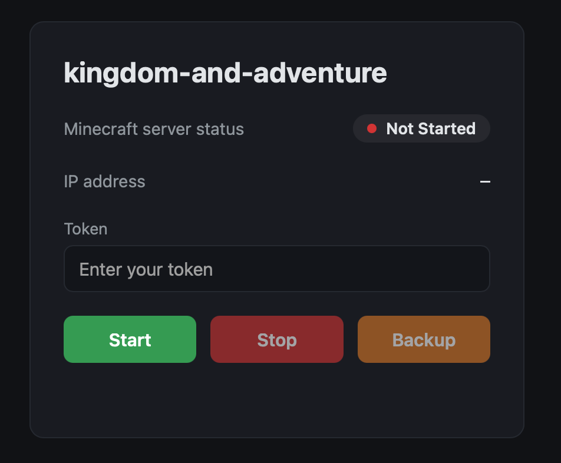
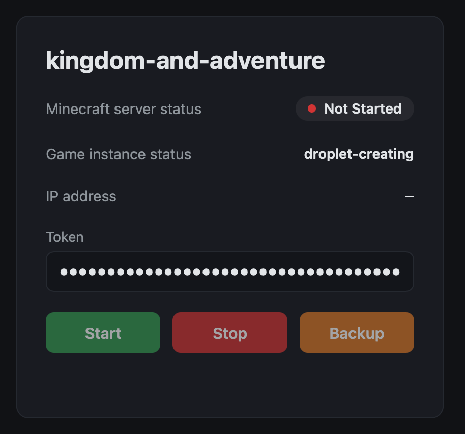
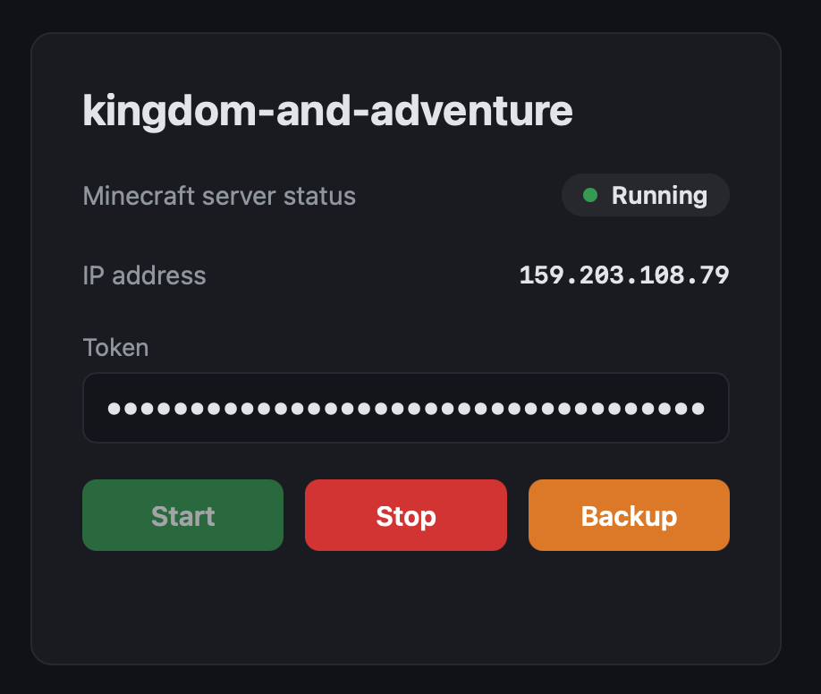

# (Snowy) Outpost

Hosting a Minecraft server and playing on it with my friends has been my dream since I was a kid. Now that I have my own server, I'm only one step away from making that dream come true. However, Snowy's hardware is modest and insufficient to host a modded Minecraft server, which typically requires 8 GiB of memory. Renting an always-on cloud server with better specifications is costly for me, as I don't yet have a full-time job.

After a couple of minutes of thinking, I came up with an approach to address this: create a DigitalOcean Droplet (a cloud instance) whenever I need to host a Minecraft server and copy the game files to it; when I no longer need the server, copy the files back to Snowy and delete the Droplet. The idea is straightforward, but implementing it still requires a fair amount of work. What motivates me is that this gives me an opportunity to learn about cloud development and Bash scripting.

## User Requirements

Before designing the app, let's analyze the user requirements first. Because I want my friends to be able to turn the server on and off by themselves, I need to design a webpage containing a panel that displays some information about the server and three buttons: start, stop, and backup.

As a user, I want to know whether the server is running and what its IP address is. If the server is starting, I also want to know which stage it is currently in. I also want to start the server when it is off and stop it when it is on. Additionally, losing several hours of gameplay progress is frustrating, so I want to be able to manually back up the save while the server is running.

## Software Design

DigitalOcean provides a useful CLI tool, `doctl`, that allows authorized users to perform operations easily through commands. Our automation scripts will be based entirely on it.

When starting the server, we first create a DigitalOcean Droplet (hereafter referred to as the "Minecraft Droplet") using `doctl` and obtain its ID and public IP address. We then wait for the Droplet to be ready to accept SSH connections. Once it is ready, we upload the Minecraft server files, including Minecraft, the game save, mods, and other files, to the Droplet. Finally, we start the Minecraft server using `tmux` so that it continues running in the background.

When deleting the server, we first SSH into the Droplet and stop the Minecraft server, then download the Minecraft server files from the Droplet using `scp`, and finally delete the Droplet with `doctl`.

More specifically, every directory in the "game root directory", which is specified by the maintainers, is considered a Minecraft game. When the application starts or stops a specified game, the game directory with the same name will be copied or overwritten. Because the frontend needs to show "which stage it is currently in" during startup and shutdown, we need to update the status, which is persisted in a JSON file, whenever we complete a step.

## Software Implementation

Before implementing this application, we need to keep in mind that this is a simple project. Therefore, the architecture should focus only on satisfying the design requirements and minimizing abstraction intended for future extensions.

To describe the implementation in detail, let's first look at the environment variables that the application needs to run:

```typescript
const defaultEnv = {
    // Temporary directory to use for storing temporary files.
    tempDir: '~/.cache/snowy_outpost',

    // State directory to use for storing persistent state files.
    stateDir: '~/.local/state/snowy_outpost',

    // DigitalOcean Droplet configuration
    dropletName: 'minecraft-server',
    dropletProjectId: '',
    dropletVpcUuid: '',
    dropletRegion: '',
    dropletSize: '',
    dropletSshKeyId: '',

    // The username to use for connecting to the Minecraft server via SSH.
    minecraftServerUsername: 'james',

    // The SSH private key file to use for connecting to the Droplet.
    sshPrivateKeyFile: '~/.ssh/id_ed25519_snowy_outpost',

    // The SSH public key file to use for creating the Droplet.
    sshPublicKeyFile: '~/.ssh/id_ed25519_snowy_outpost.pub',

    // The root directory storing all the Minecraft game directories.
    gameRootDir: '~/minecraft',

    // The name of the tmux session to use for running the Minecraft server.
    tmuxSession: 'minecraft',

    // The port to use for the Hono server.
    serverPort: '5882',

    // The application prefix to use for Hono routes.
    appPrefix: '/outpost',
}
```

This default environment object is defined in `src/env.ts`. When the application starts, a runtime environment object is created by copying the default one, and its values are overridden if the corresponding environment variables are set. The corresponding environment variable name is the uppercase version of the key in the default environment object, prefixed with `SNOWY_OUTPOST_`. For example, the environment variable for `tempDir` is `SNOWY_OUTPOST_TEMP_DIR`. The runtime environment object is then exported and used throughout the application.

### Create the Game Instance

A **game instance** is an object that represents a Minecraft server. It contains three properties: `dropletId`, `dropletPublicIpv4`, and `status`. The `dropletId` is the ID of the DigitalOcean Droplet that hosts the Minecraft server. The `dropletPublicIpv4` is the public IPv4 address of the Droplet. The `status` indicates the current stage of the game instance, as defined by the `GameInstanceStatus` type:

```typescript
export type GameInstanceStatus =
    | 'droplet-creating'
    | 'game-directory-uploading'
    | 'server-starting'
    | 'server-running'
    | 'server-stopping'
    | 'game-directory-downloading'
    | 'droplet-deleting'
```

The game instance is persisted in a JSON file with the same name as the game directory and is stored in the state directory. Every time the status changes, the JSON file is updated. After the Minecraft server is completely stopped and the Droplet is deleted, the JSON file is removed.

### Create the Droplet

The `script/create-droplet.sh` file creates a DigitalOcean Droplet using the `doctl` command. The maintainers should properly set the environment variables whose names start with `droplet`. The following commands are useful for checking available projects, regions, and so on:

```bash
# Display all projects.
doctl projects list --format ID,Name

# Display all VPC UUID.
doctl vpcs list --format ID,Name,Region,IPRange

# Display regions (e.g., nyc3, sfo3).
doctl compute region list --format Slug,Name,Available

# Display Droplet sizes (e.g., s-2vcpu-2gb-intel).
doctl compute size list --format Slug,Memory,VCPUs,Disk,PriceMonthly

# Display all SSH keys, which are set by users in the DigitalOcean control panel.
doctl compute ssh-key list --format ID,Name,FingerPrint
```

The script creates a Droplet with the provided specifications and echoes the Droplet ID and public IP address. The `--user-data-file` option used by the command in this script specifies a cloud-init configuration file. Its template is defined in `template/minecraft-droplet-init.yaml`. The `{{ username }}` and `{{ ssh_public_key }}` placeholders in the template are replaced with the value of `minecraftServerUsername` and the contents of the SSH public key file specified by `sshPublicKeyFile`, respectively.

### Await for the Droplet to be Ready

The successful execution of the `script/create-droplet.sh` script does not mean that the Droplet is ready to accept SSH connections. After the Droplet is created, the SSH server takes some time to start. The `script/await-droplet-ready.sh` script checks whether the Droplet is ready by attempting to establish an SSH connection to it. The number of attempts is limited to 60, and the script sleeps 3 seconds between attempts. Hence, the script waits for a maximum of 3 minutes, which is usually enough time for the Droplet to become ready.

But this is not over yet. Behind the scenes, DigitalOcean is still provisioning the Droplet using `cloud-init`, which may take one or two minutes. The script continues to wait for it to finish by running `cloud-init status --wait`.

### Uploading the Game Directory

The `script/upload-game-directory.sh` script uploads the game directory to the Droplet using `scp`. Because it uploads the files one by one, the process may take a while to complete. The larger the game directory, the longer the upload takes.

### Start the Minecraft Server

The `script/start-minecraft-server.sh` script starts the Minecraft server in a `tmux` session on the Minecraft Droplet. After the script is executed, the Minecraft server runs in the background, and players can connect to it using the Droplet's public IP address.

The entire "starting the Minecraft server" process triggered by clicking the "Start" button on the panel consists of the four steps described above: creating the Droplet, waiting for it to be ready, uploading the game directory, and starting the Minecraft server. The status of the game instance is updated after each step.

### Stop the Minecraft Server

The "stopping the Minecraft server" process triggered by clicking the "Stop" button on the panel is the reverse of the "starting the Minecraft server" process. It consists of three steps: stopping the Minecraft server, downloading the game directory, and deleting the Droplet. The status of the game instance is updated after each step. The following scripts are executed sequentially to perform these steps:

1. `script/stop-minecraft-server.sh`: Stops the Minecraft server running in the `tmux` session on the Minecraft Droplet.
2. `script/download-game-directory.sh`: Downloads the game directory from the Droplet to the local machine using `scp`.
3. `script/delete-droplet.sh`: Deletes the Minecraft Droplet using the `doctl` command.

The game instance file is removed after the Droplet is deleted.

### Frontend

The frontend panel is a simple webpage that displays the status and IP address of the Minecraft server. It is rendered on the server side using the Hono framework. If the server is not running, the status is "Not Started," and the IP address is shown as a dash. To start the server or perform other operations, users must enter the correct token in the token input box. The token is a secret string generated by the maintainers and stored in `credential/token`. The maintainers provide the token to trusted users, who can then use it to perform operations using the buttons on the panel.

<p align="center">
    
</p>

After clicking the "Start" button, the game instance status is updated to "droplet-creating."

<p align="center">
    
</p>

When the server has fully started and is ready to join, the game instance status is hidden, the server status is updated to "Running," and the IP address is displayed.

<p align="center">
    
</p>

The "Start" and "Backup" buttons are disabled while the server is running, and the "Stop" button is disabled while the server is not running. The webpage polls the server every 3 seconds for status updates.

## Caveats

This project is just a personal side project and is pretty buggy. For example, if it fails to create a Droplet, it won’t remove the game instance file, so the maintainers have to delete it manually. Neither I nor anyone else will maintain this project. It’s just another little gadget that preserves my memories of playing Minecraft with my friends.

## AI Usage

The `template/panel.html` file was generated by Codex and was not carefully reviewed. Other files in this project, including this document, were handwritten by me.

## Acknowledgements

Special thanks to @ChristianDodge for his valuable feedback on this project.
